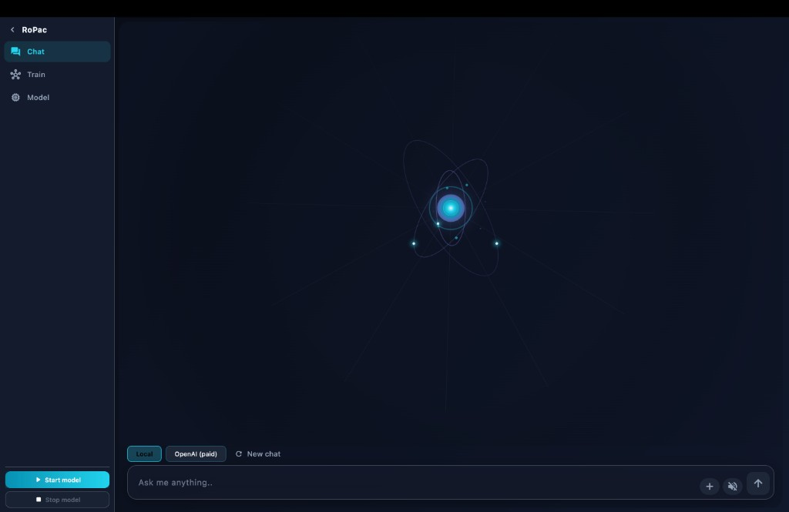
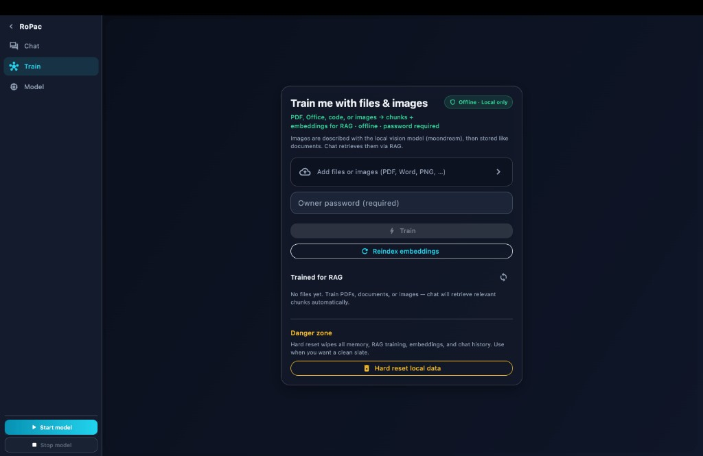
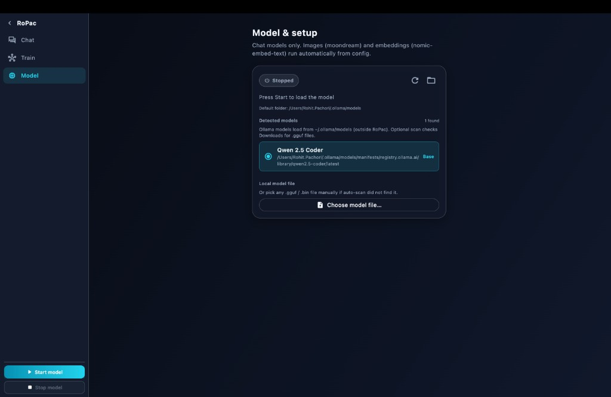

# RoPac

**Portable personal AI** — local chat, document training, and memory on your Mac. Runs offline with [Ollama](https://ollama.com). Flutter macOS app + Python backend.

---

## Screenshots

### Chat
Stream with local Ollama or OpenAI. Use **New chat** to start fresh — old messages are not sent to the model.



### Train
Upload PDFs, Office docs, code, or images. Builds offline RAG with embeddings (password required).



### Model
Pick and load chat models from Ollama or a local `.gguf` file. Start / stop from the sidebar.



---

## Features

| Feature | Details |
|---------|---------|
| **Local chat** | Streaming replies via Ollama (`qwen2.5-coder`, custom `roPac` model) |
| **Train / RAG** | PDF, Word, Excel, images → chunks + embeddings for retrieval |
| **Memory** | Owner-password commands: `save this->`, `delete this->`, Train tab |
| **Encrypted storage** | Optional AES encryption for memory + knowledge at rest |
| **Speak aloud** | Offline Piper TTS (Hindi / English) |
| **New chat** | Clears UI history and attachment cache so the model starts fresh |
| **Portable** | Copy the whole folder to another Mac — data travels with you |

Everything runs on **localhost**. No cloud required for chat or memory.

---

## Requirements

1. [Python 3.10+](https://python.org)
2. [Ollama](https://ollama.com) — keep the app running
3. **macOS app:** Flutter SDK + Xcode

---

## Quick start

### 1. Clone and install

```bash
git clone https://github.com/githubrohitgithub/roPac.git
cd roPac
chmod +x install.sh setup.sh start.sh start_ui.sh scripts/build_macos_app.sh
./install.sh
```

### 2. Build the desktop app

```bash
./scripts/build_macos_app.sh
```

Installs **`RoPac.app`** on your Desktop. Open **Ollama** first, then double-click **RoPac**.

### 3. Use the app

| Tab | What to do |
|-----|------------|
| **Chat** | Ask anything — tap **Start model** in the sidebar for local LLM |
| **Train** | Add files + owner password → **Train** |
| **Model** | Select base model → **Start model** / **Stop model** |

**Terminal chat** (no UI):

```bash
./start.sh
```

---

## Memory commands

| Command | Action |
|---------|--------|
| `save this-> <fact>` | Save to long-term memory (password) |
| `delete this-> <text>` | Remove matching facts (password) |
| **Train tab** | Learn from uploaded files (password) |

Default password on first setup: `AdminRohit` — change with `python change_password.py`.

---

## Project layout

```
roPac/
├── ropac_ui/          # Flutter macOS app
├── bridge.py          # App ↔ Python bridge
├── assistant.py       # Chat, memory, commands
├── data/              # Memory, knowledge, settings (your data)
├── ollama_models/     # Optional bundled model weights
├── Modelfile          # Custom roPac Ollama model
└── scripts/           # Build, TTS, migration helpers
```

---

## Documentation

| Doc | Topic |
|-----|-------|
| [GUIDE.md](GUIDE.md) | Full command reference |
| [docs/complete-guide.md](docs/complete-guide.md) | End-to-end walkthrough |
| [docs/migration-guide.md](docs/migration-guide.md) | Move to another Mac |
| [docs/system-design.md](docs/system-design.md) | Architecture + security |
| [MIGRATION.md](MIGRATION.md) | Short migration notes |

---

## Privacy

Chat, memory, and trained documents stay on your machine. Optional OpenAI mode uses your own API key (session only, not saved to disk).

---

## License

Personal project — use and modify for your own setup.
