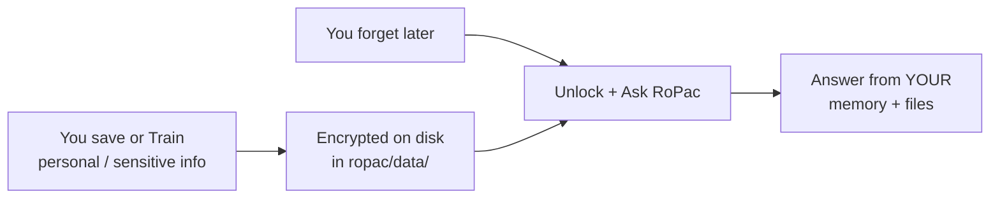
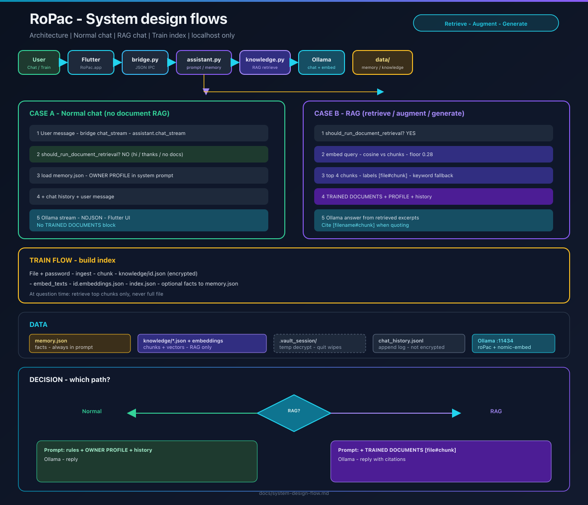
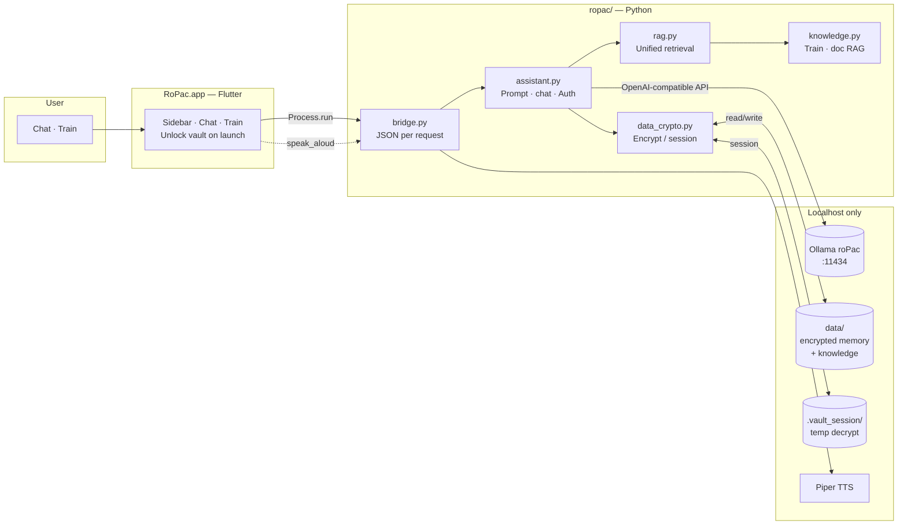
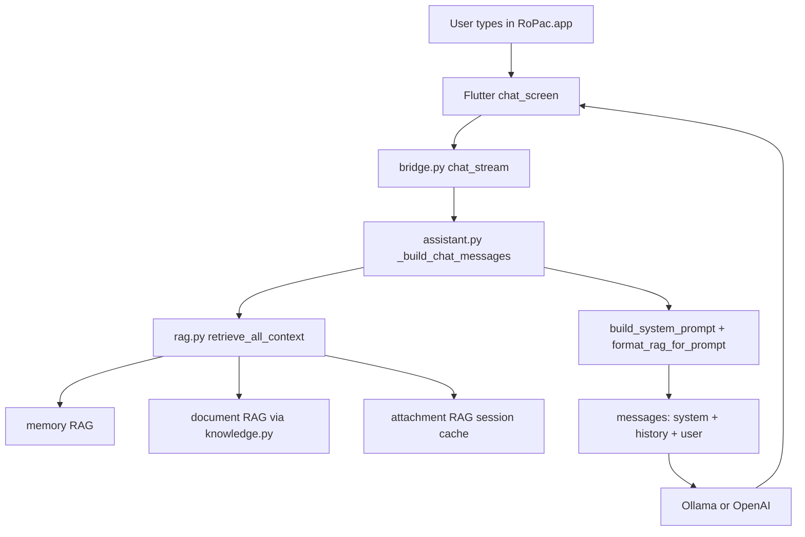
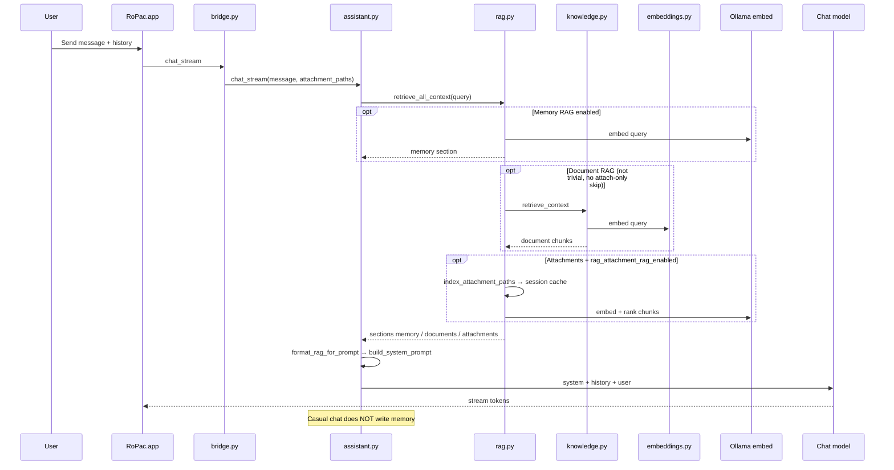
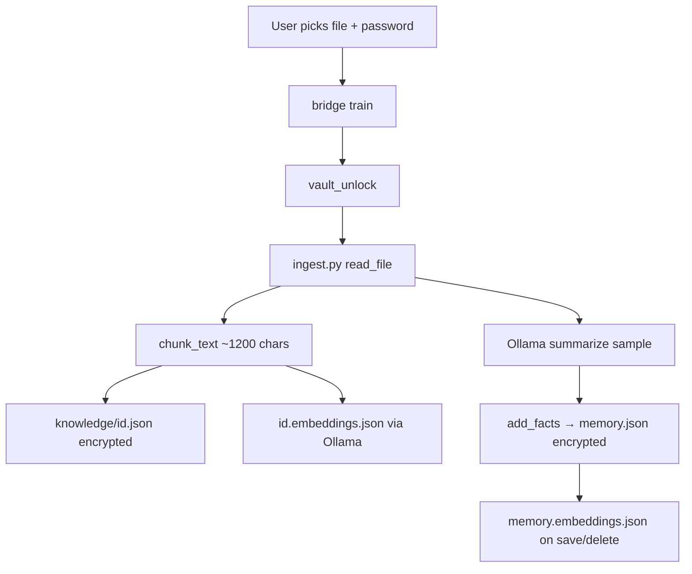
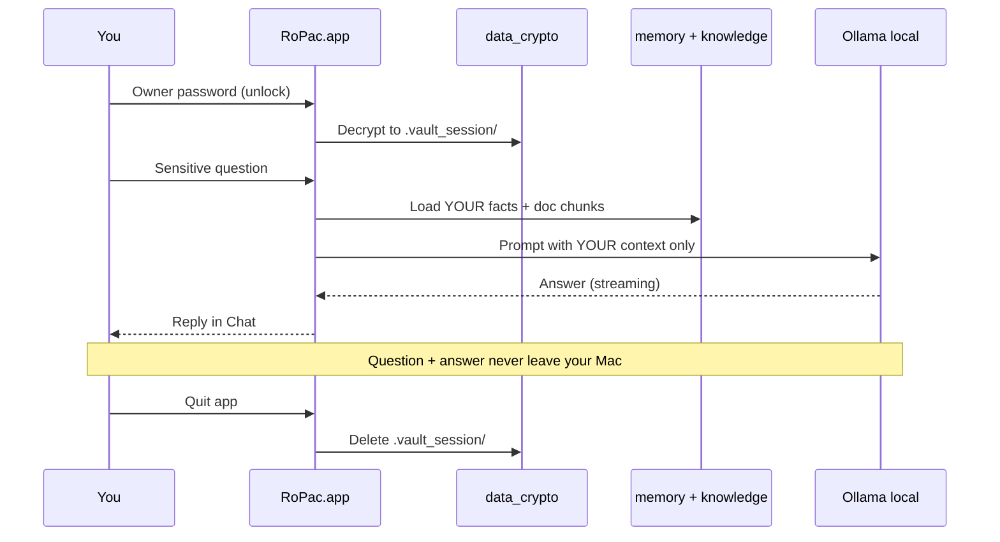
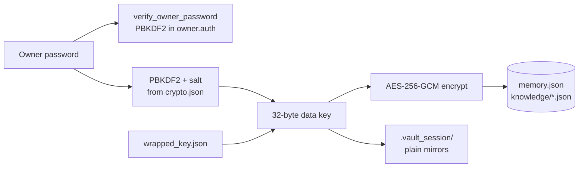
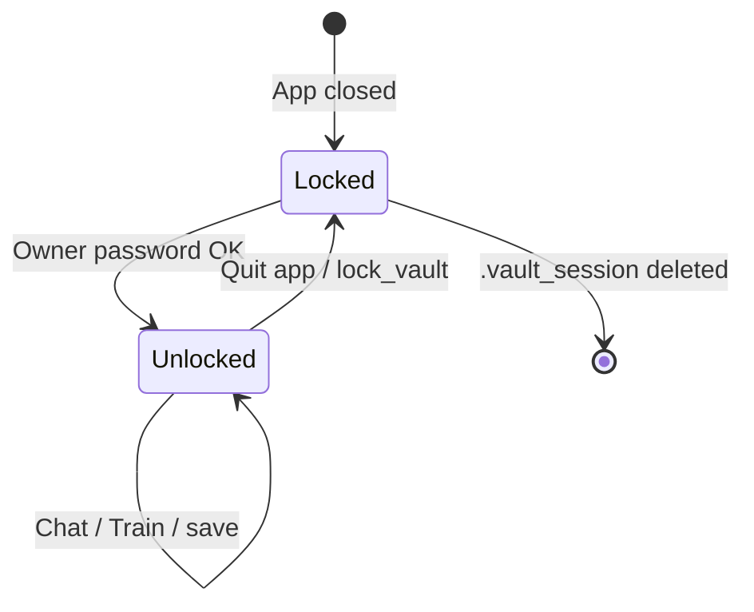
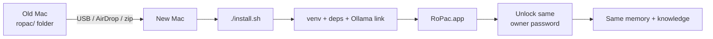

# RoPac — system design

How RoPac works, how your **personal and sensitive** data stays secure, and why it is safe to treat RoPac as **your private assistant** — including when you **forget** something and need help.

**Diagrams:**

| Diagram | What it shows | SVG | PNG |
|---------|----------------|-----|-----|
| **System design flows** | Architecture · normal vs RAG chat · train · data | [ropac-flow-diagrams.svg](./assets/ropac-flow-diagrams.svg) | [ropac-flow-diagrams.png](./assets/ropac-flow-diagrams.png) |
| **Your personal assistant** | Teach → secure → ask anything | [ropac-personal-assistant.svg](./assets/ropac-personal-assistant.svg) | [ropac-personal-assistant.png](./assets/ropac-personal-assistant.png) |
| **Personal data security** | Encryption, unlock, sensitive Q&amp;A | [ropac-data-security.svg](./assets/ropac-data-security.svg) | [ropac-data-security.png](./assets/ropac-data-security.png) |
| **Architecture & data flow** | Technical pipeline | [ropac-system-design.svg](./assets/ropac-system-design.svg) | [ropac-system-design.png](./assets/ropac-system-design.png) |

**Animated chat flow (HTML):** [chat-flow-animation.html](chat-flow-animation.html) — step-by-step blocks for **full RAG** vs **normal chat** (“hi”, time questions).

**Regenerate PNGs:** `./scripts/generate_system_design_image.sh`

**Related:** [complete-guide.md](complete-guide.md) · [migration-guide.md](migration-guide.md) · [chat-flow-animation.html](chat-flow-animation.html)

---

## RoPac is your personal assistant

RoPac is not a generic internet chatbot. It is a **local assistant on your Mac** that answers using **what you taught it** — facts you saved, documents you trained, and context you chose to store.

### What you can ask (personal and sensitive)

After you unlock with your **owner password**, you can ask RoPac about anything that lives in **your** RoPac data, for example:

| You might ask… | RoPac uses… |
|----------------|-------------|
| “Where did I note my WiFi password?” | **Retrieved** facts from `save this->` (memory RAG) |
| “Summarize the insurance PDF I uploaded” | **Retrieved** chunks from **Train** (document RAG) |
| “What stack did I say ShopMate uses?” | **Retrieved** memory facts (not full memory dump) |
| “Remind me what I wrote about my father’s advice” | Memory RAG + trained doc chunks |
| Coding, health notes, bank hints you **chose to save** | Your memory + files |

**Important:** RoPac only knows what **you** (or someone with your password) put in. It does not browse the web for your private facts unless you enable optional internet mode for research.

### When you forget — that is the point

Many people use RoPac like a **second brain**:

1. **Save** small facts you will need later (`save this-> …` + password).  
2. **Train** larger material (PDF, Word, notes) once.  
3. **Forget** the detail months later.  
4. **Unlock** the app, **ask in plain language**, get an answer from **your** data — on **your** machine.

**Default chat** uses **Ollama** on `127.0.0.1`. Optional **OpenAI** (paid) uses your runtime API key from the UI — keys are not stored on disk. **RAG retrieval** (embeddings) always uses local Ollama (`nomic-embed-text`), not the cloud chat provider.

### What makes sensitive questions safe here

| Concern | RoPac behavior |
|---------|----------------|
| “Will my question leak online?” | **Local** mode: Ollama only. **OpenAI** mode: chat goes to OpenAI if you enter a key; your indexed files stay on disk |
| “If someone steals my laptop folder?” | Memory and training files are **AES encrypted** without your password |
| “While I use the app?” | Decrypted copy only in `data/.vault_session/` — **deleted when you quit** |
| “Can anyone change my memories?” | Only with **owner password** (save, delete, Train) |
| “Can a guest read my secrets?” | They can **chat**, but should not get your password; memory is for **your** unlock |

See the full security diagram below and [encrypted-storage.md](encrypted-storage.md).

### What RoPac is not

- **Not** a substitute for a lawyer, doctor, or financial advisor for critical decisions.  
- **Not** automatic memory from every chat — you control what is saved (`save this->`, Train).  
- **Not** shared with the world — it is **your** portable `ropac` folder on **your** Mac(s).

---

## Design goals

| Goal | How RoPac achieves it |
|------|------------------------|
| **Offline-first** | Default Ollama + local Python; optional OpenAI chat with runtime key |
| **Full RAG** | Memory, trained docs, attachments retrieved per query (`rag.py`) |
| **Portable** | One `ropac/` folder: models, memory, voices, code |
| **Private** | `127.0.0.1` only; subprocess bridge (no HTTP server) |
| **Controlled memory** | Owner password for save / delete / train |
| **Encrypted personal data** | AES-256-GCM at rest; session decrypt; wipe on quit |

---

## High-level architecture

---

## Five layers

| Layer | Component | Responsibility |
|-------|-----------|----------------|
| **1 — Presentation** | `ropac_ui/` (Flutter) | UI, model start/stop, vault unlock dialog, streaming display |
| **2 — Bridge** | `bridge.py` | Route JSON actions; no network server; one process per request |
| **3 — Application** | `assistant.py`, `rag.py`, `knowledge.py`, `embeddings.py`, `auth.py`, `ropac_personal_data.py` | Chat, **unified RAG**, train/index, embeddings, password checks, setup |
| **4 — Intelligence** | Ollama + `roPac` | LLM inference from `Modelfile` + `config.json` |
| **5 — Persistence** | `data/`, `ollama_models/` | Facts, document chunks, auth hash, chat log, voices, weights |

---

## Chat data flow (detailed)

**Interactive walkthrough:** [chat-flow-animation.html](chat-flow-animation.html)

### Pipeline (every message)

### Full RAG vs normal chat

| | **Normal chat** (e.g. “Hi”, “What time is it?”) | **Full RAG** (e.g. “What did I save about ShopMate?”) |
|--|--|--|
| **Memory** | No matching facts retrieved → empty memory section | Top-K facts from `memory.embeddings.json` |
| **Trained docs** | Skipped (trivial message and/or `rag_skip_trivial_messages`) | Top chunks from `*.embeddings.json` |
| **Attachments** | None, or RAG chunks if files attached | Session `data/knowledge/sessions/<hash>.json` |
| **System prompt** | Rules + owner name only (`owner_profile_preamble`) | Same + **RETRIEVED KNOWLEDGE** block |
| **Chat history** | Full session thread (always) | Full session thread (always) |

**Important:** RoPac no longer dumps **all** `memory.json` facts into every system prompt. The Memory UI / `memory` bridge action still shows the full list; chat uses retrieval only.

### What goes into each reply

1. **System prompt** — personality (`Modelfile`), guest vs owner rules, memory rules  
2. **Owner preamble** — machine owner name only; facts **when retrieved**  
3. **RETRIEVED KNOWLEDGE (RAG)** — optional block with up to three sections:
   - **OWNER MEMORY** — top facts for this query (`rag.py` → `memory.embeddings.json`)
   - **TRAINED DOCUMENTS** — top chunks (`knowledge.py`)
   - **ATTACHED FILES** — top chunks for this message (`sessions/*.json`)
4. **Chat history** — prior turns from the Flutter session (not embedding-searched)  
5. **User message** — current question  
6. **Optional** — live web context if Internet mode is on  

Chat model: **local** Ollama (`config.json` → `ollama_base_url`) or **OpenAI** if you pass a runtime key. Embeddings for RAG use local Ollama regardless.

### RAG config (`config.json`)

| Key | Purpose |
|-----|---------|
| `embeddings_enabled` | Master switch for vector retrieval |
| `rag_memory_enabled` | Retrieve owner facts per query |
| `rag_retrieval_enabled` | Retrieve trained documents |
| `rag_attachment_rag_enabled` | Chunk attachments vs full-file paste |
| `rag_skip_trivial_messages` | Skip doc RAG on “hi”, “thanks”, etc. |
| `rag_top_memory_facts` / `rag_top_attachment_chunks` | Top-K limits |

Set `rag_attachment_rag_enabled: false` to restore truncation-based attachment context (`chat_attachments.py`).

---

## Train data flow

| Step | Output |
|------|--------|
| Read file | PDF, Word, Excel, text, code → plain text |
| Chunk | Many chunks in `data/knowledge/{doc_id}.json` |
| Index | Entry in `data/knowledge/index.json` + `{doc_id}.embeddings.json` |
| Summary facts | Up to ~12 bullets → `memory.json` (if password OK) |
| Memory index | `sync_memory_embeddings()` → `memory.embeddings.json` |

At **chat time**, RoPac does **not** load entire files or all memory facts — `retrieve_all_context()` scores chunks/facts by **embedding similarity** (with **keyword** fallback), applies **score floors**, then injects the best matches into one **RETRIEVED KNOWLEDGE** block.

---

## Personal data security

This diagram shows the full path: **locked encrypted files** → **your password** → **ask personal questions** → **local answers** → **session wiped on quit**.

See [encrypted-storage.md](encrypted-storage.md) for setup steps.

### Sensitive Q&amp;A flow (read this first)

### Two states of personal data

| State | Location | Readable without password? |
|-------|----------|---------------------------|
| **Locked (at rest)** | `memory.json`, `knowledge/*.json` as AES-GCM envelopes | **No** |
| **Unlocked (session)** | `data/.vault_session/` plain JSON mirrors | **Yes** (while app session active) |

### Encryption mechanics

| File | Purpose |
|------|---------|
| `data/crypto.json` | Encryption enabled, KDF salt, algorithm metadata |
| `data/wrapped_key.json` | Data key encrypted with password-derived key |
| `data/owner.auth` | Password **hash** for verification (not encryption key storage) |
| `data/.vault_session/` | **Temporary** decrypted copies + `.data_key` (deleted on `lock_vault`) |

### Session lifecycle

- **Unlock:** `vault_unlock(password)` → verify → unwrap data key → decrypt files into `.vault_session/`  
- **Read:** `read_json_file()` prefers session mirror (fast)  
- **Write:** encrypt to disk + update session mirror  
- **Lock:** `shutil.rmtree(.vault_session)` — no decrypted files left  

### What is protected vs not

| Data | Encrypted? | Notes |
|------|------------|-------|
| Memory facts | Yes (when enabled) | **Retrieved per query** when unlocked (not full dump) |
| `memory.embeddings.json` | Yes | Vector index for memory RAG |
| Trained document chunks | Yes | Document RAG only |
| Attachment session cache | Yes | `data/knowledge/sessions/*.json` — per attach set |
| Owner password | Hashed only | `owner.auth` — PBKDF2-SHA256 |
| Chat history | No | `chat_history.jsonl` append log |
| App settings | No | `settings.json` (speak aloud, voice lang) |
| LLM weights | No | `ollama_models/` (not personal) |

### Access control rules

| Action | Password? | Writes memory? |
|--------|-------------|----------------|
| Normal chat | Unlock for read | No |
| `save this->` / `delete this->` | Yes | Yes |
| Train **Submit** | Yes | Yes (chunks + optional facts) |
| `please save …` | Yes | Yes |
| Guest chatting | Unlock for read only | No |

---

## Bridge API (Flutter ↔ Python)

Each UI action spawns: `.venv/bin/python bridge.py '<json>'`

| Action | Purpose |
|--------|---------|
| `health` | Ollama reachable, model loaded |
| `start_model` / `stop_model` | Load/unload `roPac` |
| `personal_data_setup` | Deps, enable encryption, unlock |
| `unlock_vault` / `lock_vault` | Session control |
| `chat_stream` | Streaming reply (NDJSON) |
| `train` | Ingest file path + password |
| `remember` / `forget` | save/delete facts |
| `speak_aloud` | Piper / `say` playback |
| `settings` / `set_settings` | Speak aloud toggle, etc. |

**No HTTP server** — reduces attack surface; only local subprocess IPC.

---

## Portable migration (new Mac)

**Copy:** `data/` (including `crypto.json`, `wrapped_key.json`), `ollama_models/`, `config.json`, code.  
**Skip:** `.venv/`, `ropac_ui/build/`, `data/.vault_session/`.  

Guide: [migration-guide.md](migration-guide.md)

---

## Component reference

| Path | Role |
|------|------|
| `ropac_ui/` | Flutter macOS UI |
| `bridge.py` | JSON action router |
| `assistant.py` | Chat, memory commands, `build_system_prompt`, LLM client |
| `rag.py` | Unified `retrieve_all_context`, memory + attachment RAG |
| `knowledge.py` | Train, chunk, document `retrieve_context` |
| `embeddings.py` | Ollama embedding API (`nomic-embed-text`) |
| `chat_attachments.py` | Extract attachment text; fallback full paste |
| `data_crypto.py` | AES-GCM, session vault, read/write secure JSON |
| `auth.py` | Owner password hash verify |
| `ropac_personal_data.py` | Enable encryption, launch setup, migration status |
| `ingest.py` | File format readers |
| `tts_engine.py` | Piper offline speech |
| `data/memory.json` | Long-term facts |
| `data/knowledge/memory.embeddings.json` | Memory fact vectors |
| `data/knowledge/` | Trained docs, `*.embeddings.json`, `sessions/` |
| `ollama_models/` | Portable LLM weights |

---

## Privacy summary

- **Network:** Default chat uses localhost Ollama. Optional OpenAI mode sends **chat** to OpenAI with a user-supplied key; RAG indexes stay local.  
- **Third parties:** No analytics SDK in the described architecture.  
- **Encryption:** Personal facts and training files can be encrypted at rest; session plaintext wiped on quit.  
- **Defense in depth:** Use macOS FileVault + strong owner password + physical device security.  

---

## Thumbnail / export

- **Architecture PNG/SVG:** LinkedIn slide “How RoPac works”  
- **Security PNG/SVG:** Slide “How your data is protected”  
- Regenerate: `./scripts/generate_system_design_image.sh`  
- Edit SVGs in Figma, Inkscape, or any SVG editor  

**Colors:** background `#0B1220`, accent cyan `#22D3EE`, violet `#8B5CF6`, secure green `#34D399`, lock red/amber `#F59E0B` / `#EF4444`.
